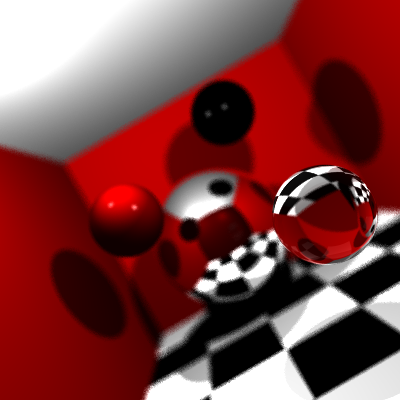

# Raytracer

    

### Features currently implemented
* Support for triangles, spheres & planes
* Support for different types of materials: diffuse, reflective, refractive & glossy
* Shadow casting
* Custom camera orientation
* Depth of field
* Anti-aliasing

### Features to be implemented
* Support for emissive materials
* OBJ model support
* Ambient occlusion

                                     
### References

* https://www.scratchapixel.com/lessons/3d-basic-rendering/ray-tracing-rendering-a-triangle  
* https://www.scratchapixel.com/lessons/3d-basic-rendering/minimal-ray-tracer-rendering-simple-shapes/ray-sphere-intersection  
* https://www.scratchapixel.com/lessons/3d-basic-rendering/minimal-ray-tracer-rendering-simple-shapes/ray-plane-and-ray-disk-intersection  
* https://www.scratchapixel.com/lessons/3d-basic-rendering/introduction-to-shading/reflection-refraction-fresnel  
* https://handwiki.org/wiki/Rodrigues%27_rotation_formula  
* https://medium.com/@elope139/depth-of-field-in-path-tracing-e61180417027  
* https://www.scratchapixel.com/lessons/3d-basic-rendering/phong-shader-BRDF/phong-illumination-models-brdf  
